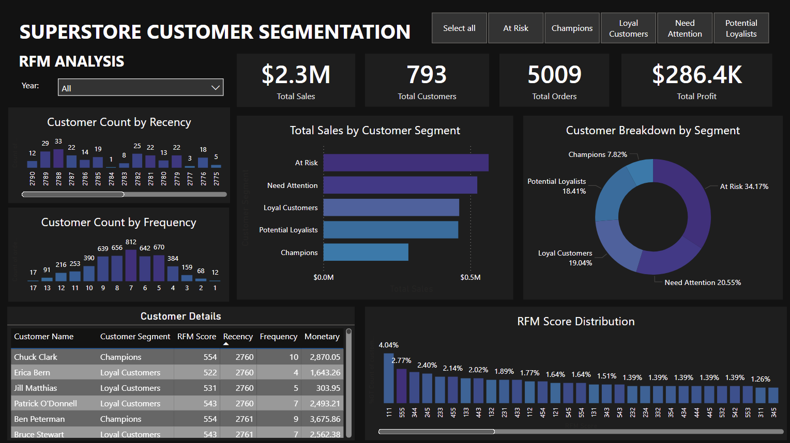

# 📊 Power BI Dashboard Projects Portfolio

Welcome to my Power BI Dashboard Portfolio! This repository showcases a collection of data visualization projects developed using Power BI to solve real-world business problems across various domains, including sales, marketing, customer behavior, and operations.

Each project demonstrates my skills in data cleaning, modeling, DAX calculations, and visual storytelling to deliver actionable business insights.

---

## 🔍 Project Overviews

### 1. 🐝 Bee Cycle Sales Intelligence Dashboard

- **Objective:** Provide a comprehensive view of sales performance, customer profiles, and product insights.
- **Pages:**
   - Overall Sales Trends: Track revenue and profit growth over time.
   - Customer Profiling: Analyze demographics, customer type, and behavior to uncover key personas.
   - Product Performance: Identify bestsellers and underperformers by category and region.
- **Impact:** Supports data-driven marketing, inventory planning, and business growth strategies.
- **Preview:**
  

### 2. 🎯 Superstore Customer Segmentation via RFM Analysis
- **Objective:** Group customers based on recency, frequency, and monetary value to guide marketing strategies.
- **Key Features:** RFM scoring, segmentation (e.g., Champions, At Risk), customer distribution, and behavior insights.
- **Impact:** Supports targeted campaigns, customer retention, and lifetime value optimization.
- **Preview:**
  

## 🧰 Tools & Technologies
- **Power BI**: For dashboard design, DAX modeling, interactivity.
- **Power Query (M)**: For data transformation and cleanup.
- **Excel / CSV / SQL**: Data sources used across projects.
- **GitHub**: Version control, documentation, and collaboration.

## 💡 Why Power BI?
Power BI enables fast, scalable, and interactive dashboards for decision-makers. These projects reflect my commitment to not just building beautiful visuals—but solving problems through data storytelling, segmentation, and performance tracking.

## 🙌 Let’s Connect
I’m always open to collaboration, feedback, or just talking data!
